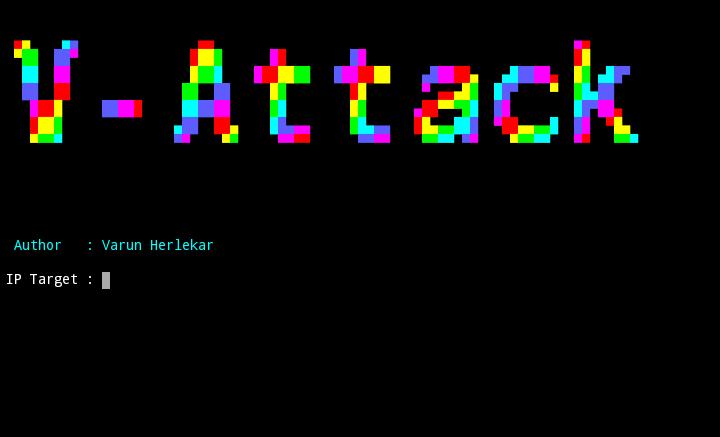
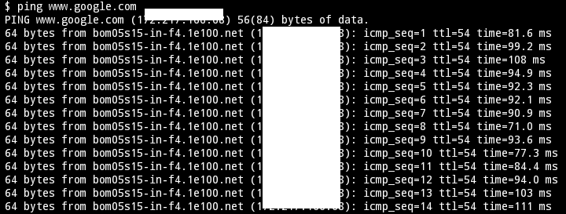

# V-Attack DDos Attack Tool - Termux
# Made By Varun Herlekar
### This script will help you for the DDos Attack. Enjoy! ! 

#### Installing

1. apt update && apt upgrade
2. git clone https://github.com/varunherlekar/v-attack
3. chmod +x *
4. python2 vattack.py

#### Finding Ip Address Of A Website

1. Open A New Termux Session
2. Type **ping "website url"** ("" Not Required).
3. Copy The IP address and paste in the V-ATTACK tool.

! 

